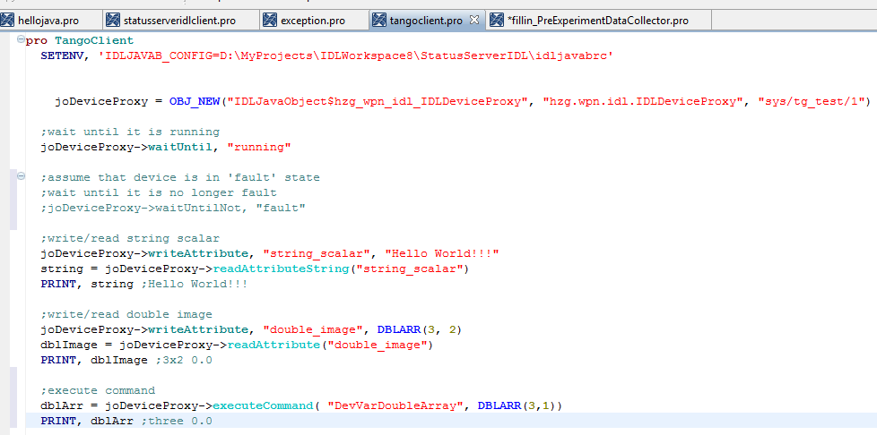

# IDL2Tango Java bridge

[](https://travis-ci.org/xenvwpi/idl2tango)
[](https://coveralls.io/github/xenvwpi/idl2tango?branch=master)
[](https://www.versioneye.com/user/projects/593175e722f278006540a1b6)
[](https://codebeat.co/projects/github-com-xenvwpi-idl2tango-master)

[  ](https://bintray.com/hzgde/maven/idl2tango/_latestVersion)

This project is a part of [X-Environment](http://www.github.com/xenvhzg) (Integrated Control System for High-throughput Tomography experiments). X-Environment is a bunch of components that server two main goals:

* Collect data during the High throughput Tomography experiment in a non-disturbing way (does not disturb experiment)
* Provide high level abstraction for beamline scientist to control the experiment

This library corresponds to the second goal. It bridges [IDL](http://www.harrisgeospatial.com/ProductsandTechnology/Software/IDL.aspx) and [Tango Control System](http://www.tango-controls.org)

# Usage

Basic guideline: download, store some where, adjust IDL environment (idljavabrc file):

```

# Allow IDL-Java bridge to use .class files located in my CLASSPATH and also the
# classes found in the examples .jar file shipped with the bridge

JVM Classpath = $CLASSPATH:<path_to_library>/idl2tango-<version>.jar
```

__NOTE__ remember Windows VS Linux separators (`;` VS `:`) and path delimeters (`\` VS `/`)

See this code sample:



